# mtcnn_demo

mtcnn Demo


这是一个 人脸检测的 Demo， 用于输出适合人脸识别的 人脸数据集
---

## 生成结果

```py
python mtcnn_demo.py
```

原图
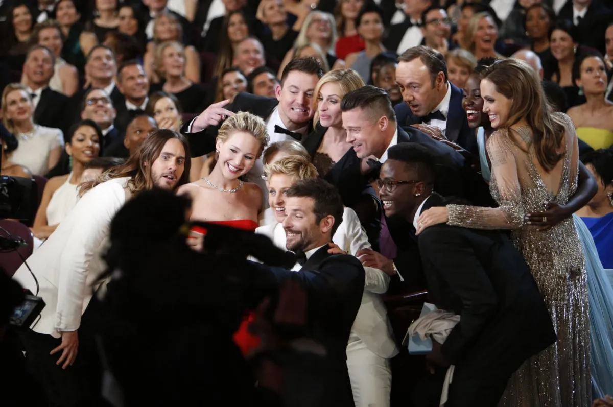

生成标记后图片，`粉色`数据为标记 `不合格`数据，`全部蓝色`数据为`合规`数据,及需要处理的数据

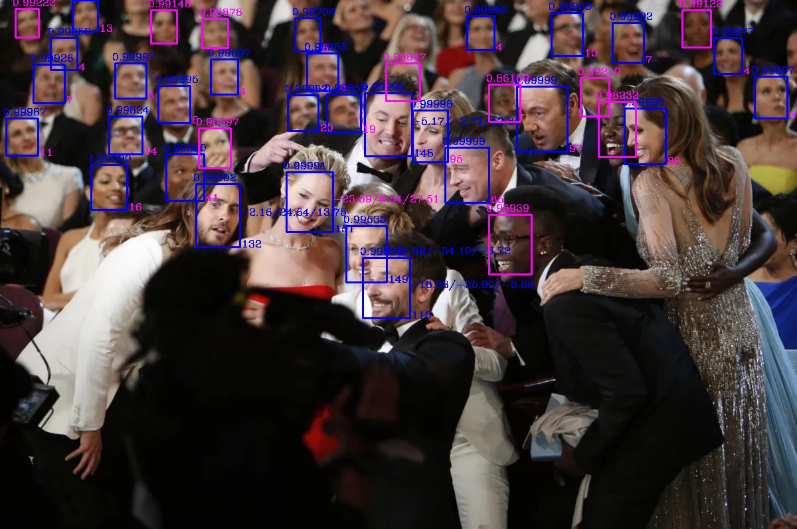

标记含义：

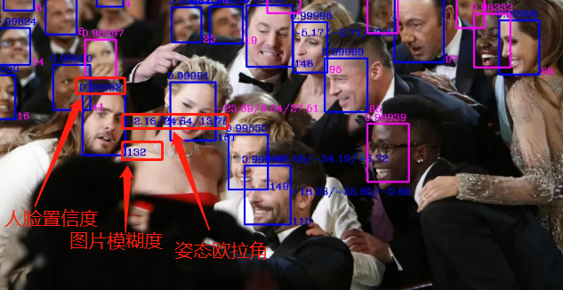

符合条件筛选的人脸

|人脸原始图片|对齐后的人脸|头部原始图片|对齐后头部姿态|
|--|--|--|--|
|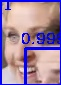|||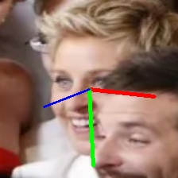|
||||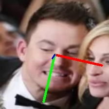|
||||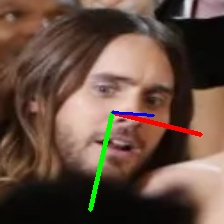|
||||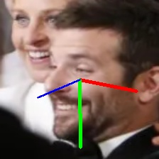|
---

## 检测使用 mtcnn

创建 虚拟环境，导入依赖
```bash
(base) C:\Users\liruilong>conda create -n mtcnn python==3.8.8
```

<https://pypi.org/project/mtcnn/>

```py
def __init__(self, weights_file: str = None, min_face_size: int = 20, steps_threshold: list = None,
                 scale_factor: float = 0.709):
        ""
        Initializes the MTCNN.
        :param weights_file: file uri with the weights of the P, R and O networks from MTCNN. By default it will load
        the ones bundled with the package.
        :param min_face_size: minimum size of the face to detect
        :param steps_threshold: step's thresholds values
        :param scale_factor: scale factor
        """
        if steps_threshold is None:
            steps_threshold = [0.6, 0.7, 0.7]

        if weights_file is None:
            weights_file = pkg_resources.resource_stream('mtcnn', 'data/mtcnn_weights.npy')

        self._min_face_size = min_face_size
        self._steps_threshold = steps_threshold
        self._scale_factor = scale_factor

        self._pnet, self._rnet, self._onet = NetworkFactory().build_P_R_O_nets_from_file(weights_file)
```

影响 `MTCNN` 单张测试结果的准确度和测试用时的主要因素为：

`网络阈值(steps_threshold)`

`MTCNN` 使用了一系列的阈值来进行人脸检测和关键点定位。这些阈值包括人脸 `置信度`阈值（Face Confidence Threshold）、`人脸框`与 `关键点`之间的IoU（Intersection over Union）阈值等。上面的构造函数 MTCNN的三个阶段（P-Net、R-Net和O-Net）中，相应的阈值设置为0.6、0.7和0.7。

1. 在 `P-Net`阶段，它是一个浅层的卷积神经网络，生成 `候选人脸框`时，只有置信度大于等于0.6的候选框将被接受，其他低于该阈值的候选框将被拒绝。
2. 在 `R-Net`阶段，一个较深的卷积神经网络，用于对P-Net生成的候选框进行筛选和精细调整。R-Net会对每个候选框进行特征提取，并输出判断该框是否包含人脸的概率以及对应的边界框调整值，对于从P-Net阶段获得的候选框，只有置信度大于等于0.7的框将被接受，其他低于该阈值的框将被拒绝。
3. 在 `O-Net`阶段，最深的卷积神经网络，用于进一步筛选和精细调整R-Net输出的候选框。O-Net与R-Net类似，对于从R-Net阶段获得的候选框，同样只有置信度大于等于0.7的框将被接受，其他低于该阈值的框将被拒绝。O-Net还可以输出 `人脸关键点`的位置坐标。最终，O-Net提供了最终的人脸检测结果和人脸关键点的位置信息。

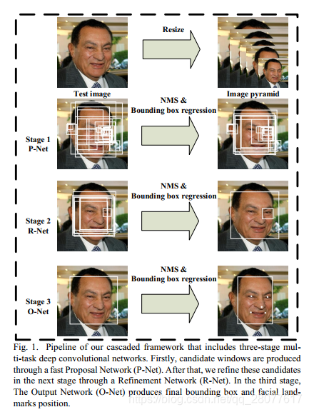

`影响因子（原始图像的比例跨度）(scale_factor)`:

`MTCNN` 使用了图像金字塔来检测不同尺度的人脸。通过对图像进行 `缩放`，可以检测到不同大小的人脸。影响因子是指图像金字塔中的 `缩放因子`，控制了不同尺度之间的跨度。`较小`的影响因子会导致 `更多`的金字塔层级，可以检测到 `更小`的人脸，但会增加计算时间。`较大`的影响因子可以 `加快检测速度`，但可能会错过 `较小`的人脸。因此，选择合适的影响因子是在准确度和速度之间进行权衡的关键。

要检测的 `最小面容参数(min_face_size)`:

这是 `MTCNN` 中用于 `过滤掉较小人脸`的参数。`最小面容参数`定义了一个 `人脸框`的 `最小边长`，小于此值的人脸将被 `忽略`。较小的最小面容参数可以检测到更小的人脸，但可能会增加 `虚警（错误接受）`的机会。较大的最小面容参数可以 `减少虚警`，但可能会漏检一些较小的人脸。因此，根据应用需求和场景，需要调整最小面容参数以平衡 `准确度和召回率`。

```py
from mtcnn import MTCNN
import cv2

img = cv2.cvtColor(cv2.imread("ivan.jpg"), cv2.COLOR_BGR2RGB)
detector = MTCNN()
detector.detect_faces(img)
```

box 为人脸矩形框，keypoints 为人脸特征点，confidence 为置信度

```bash
[
    {
        'box': [277, 90, 48, 63],
        'keypoints':
        {
            'nose': (303, 131),
            'mouth_right': (313, 141),
            'right_eye': (314, 114),
            'left_eye': (291, 117),
            'mouth_left': (296, 143)
        },
        'confidence': 0.99851983785629272
    }
]
```

## 姿态判断 deep-head-pose

姿态判断使用  deep-head-pose

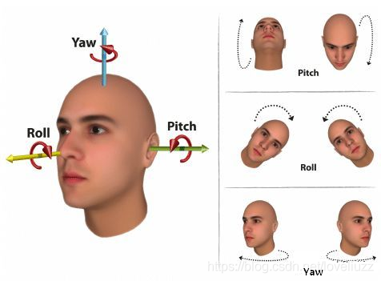

[https://blog.csdn.net/qq_44001342/article/details/113522124](https://blog.csdn.net/qq_44001342/article/details/113522124)

使用的模型项目

[https://github.com/natanielruiz/deep-head-pose](https://github.com/natanielruiz/deep-head-pose)

一个 大佬写好的 Demo

[https://colab.research.google.com/drive/1vvntbLyVxxBHoVN0e6-pfs7gB3pp-VUS?usp=sharing](https://colab.research.google.com/drive/1vvntbLyVxxBHoVN0e6-pfs7gB3pp-VUS?usp=sharing)

## 模糊度检测 拉普拉斯算子

opencv  拉普拉斯方差方法 方法

[https://pyimagesearch.com/2015/09/07/blur-detection-with-opencv/](https://pyimagesearch.com/2015/09/07/blur-detection-with-opencv/)

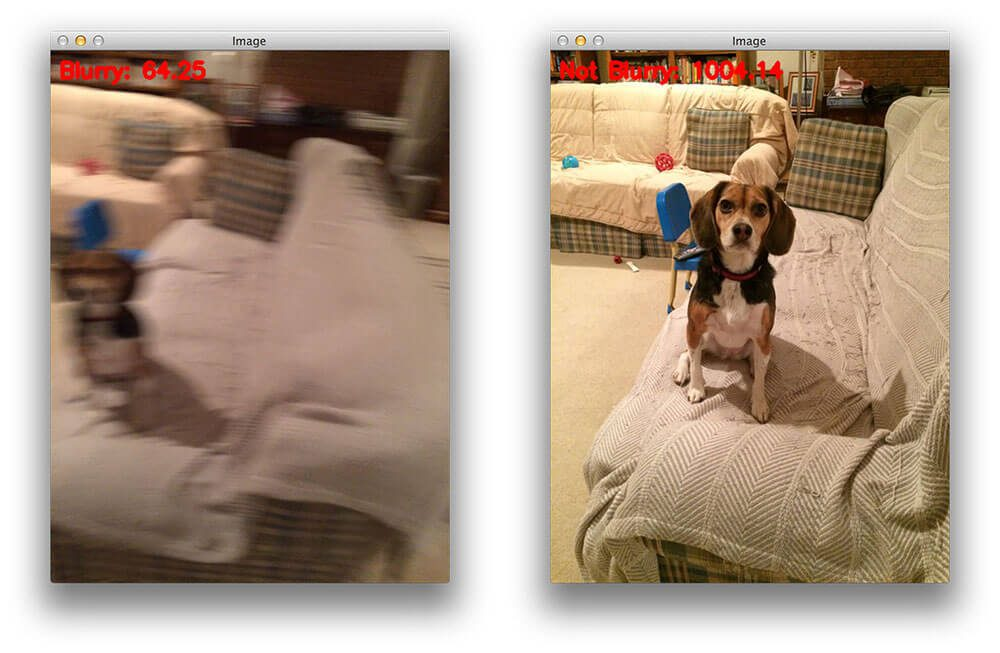
